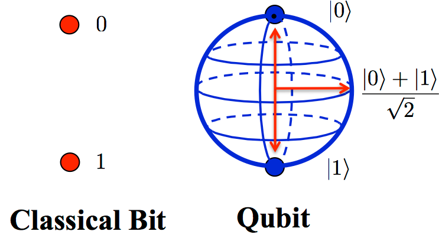
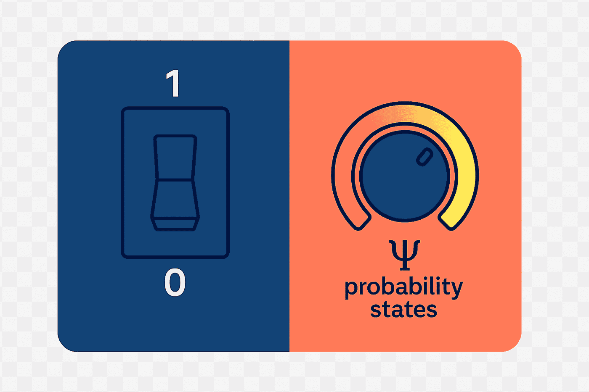
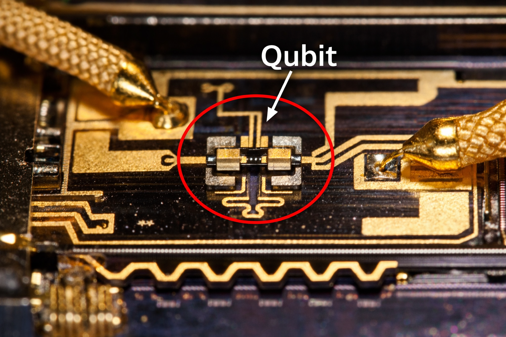
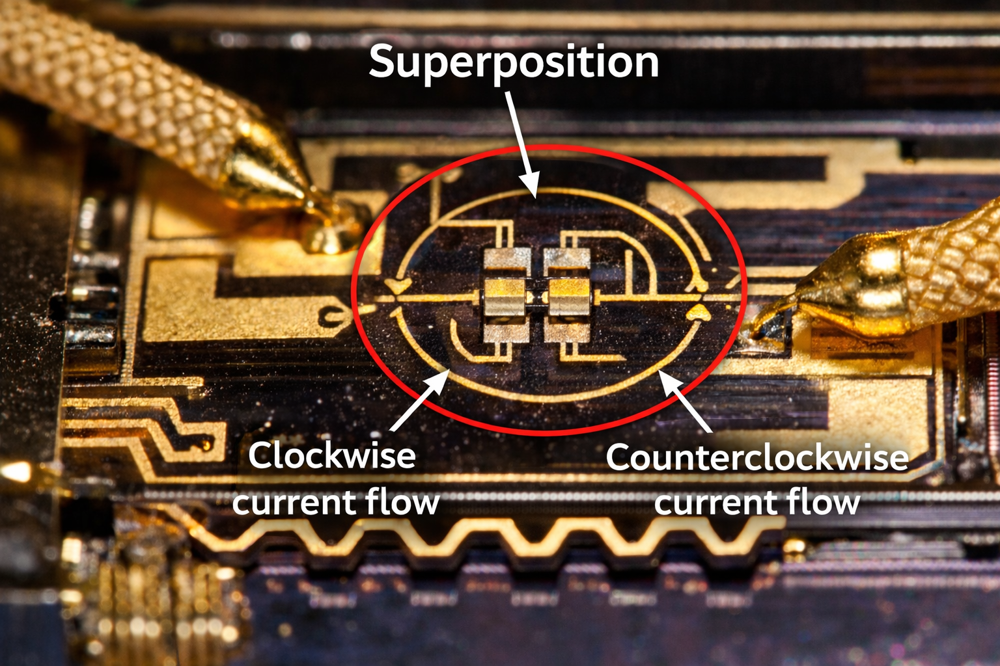

# Day 2 — What is a Qubit, really?

Previously we saw something strange.

There are two worlds:

- The classical world → predictable, definite  
- The quantum world → uncertain, weird, powerful  

Today, we step into the smallest unit of that quantum world.

Not a computer.  
Not an algorithm.  

Just one thing.

**A Qubit.**

---

## From Bit → Qubit

Let’s start from something you already know.

Your phone, your laptop, every app, every image, every video.

All of it is stored using just two symbols:

**0 and 1**

That’s it. These are called **bits**.

---

### Imagine this

Think of a light switch.

- OFF → 0  
- ON → 1  

At any moment, it is either OFF or ON.  
Never both.

That is a **classical bit**.

---

### Now comes the strange part

A qubit is not like a switch.  

It is more like a **dimmer knob**.

Not just OFF or ON…  
But anywhere in between.

---

## What is a qubit actually?

A qubit is not just a number.

It is a **real physical system** that follows quantum physics.

That system can be:

- an electron  
- a photon  
- a superconducting circuit  
- an atom  

Anything…  
as long as it behaves like a **two-state quantum system**.

---

## Real-world qubits

Let’s make it concrete.

There are different types of qubits used in real labs:

---

### Superconducting qubits

Tiny electrical circuits cooled near absolute zero  
(built using Josephson junctions)

---

### Trapped ions / atoms

Individual atoms floating in space, controlled by lasers  

---

### Electron spin qubits

Using the spin of an electron (up or down)

---

### NMR qubits

Using nuclear spins inside molecules  

---

Different hardware…  
**Same idea.**

---

## The First Real Quantum Idea — Superposition

Now we enter the real quantum world.

---

### Start simple

Take an electron.

It has a property called **spin**.

It can be:

- Spin up → 1  
- Spin down → 0  

So far, it looks like a normal bit.

---

### Now imagine this

What if I tell you:

The electron is not just up  
and not just down  

But somehow…

**both at the same time**

That is **superposition**.

---

A qubit can exist in a combination of **0 and 1 at the same time**.

Not switching fast.  
Not randomly jumping.  

But truly existing in both states together.

---

---

## Analogy: The spinning coin

Imagine flipping a coin.

- When it lands → Head or Tail  
- Classical bit → like this  

Now imagine the coin is spinning in the air.

While spinning:

- It is not head  
- Not tail  
- It is something in between  

That is a qubit.

---

### But here is the deeper truth

The spinning coin analogy is useful…  
but incomplete.

Because:

The coin is actually still either head or tail while spinning.

But a qubit is different.

It is described by **probability amplitudes**, not hidden states.

---

## What does it physically mean?

In real systems:

- Electron → exists in a combination of spin up and down  
- Photon → combination of polarizations  
- Superconducting circuit → current flows in two directions at once  

Even in superconducting loops:

Current can flow **clockwise and anticlockwise simultaneously**

That is not imagination.  
That is measured physics.

---

## What happens when we measure?

The moment you observe:

- It becomes either 0 or 1  

The superposition **collapses**

---

## Analogy: Blurred photo

Think of a moving fan.

- Fast spinning → looks like a blur  
- You don’t see individual blades  

But if you freeze it:

- You see exact positions  

Measurement is like freezing.

---

## Dirac Notation (The Language of Quantum)

This is where things start to look “math-heavy”…  
but we’ll keep it simple.

---

### What is it?

Dirac notation is just a **way to write quantum states clearly**.

That’s it.

---

### Basic symbols

You’ll see things like:

- |0⟩ → state 0  
- |1⟩ → state 1  

This is called a **ket**.

---

### What does this mean?

- |0⟩ → “The system is in state 0”  
- |1⟩ → “The system is in state 1”  

---

### Now the real power

A qubit is written like this:

|ψ⟩ = α|0⟩ + β|1⟩

---

### What does this actually mean?

- α → how much of 0 is present  
- β → how much of 1 is present  

These are not normal numbers.

They are **probability amplitudes**.

---

## Analogy: Music mixing

Think of a song.

You mix:

- 70% vocals  
- 30% instruments  

That creates a new sound.

Similarly:
α|0⟩ + β|1⟩

creates a quantum state.

---

## Why do we need this?

Because classical language fails.

We cannot say:

- “It is 0”  
- or “It is 1”  

We need a way to describe:

**both together**

---

## What can you do if you understand Dirac notation?

This is powerful.

If you understand this, you can:

- Read quantum algorithms  
- Understand quantum gates  
- Work with quantum circuits  
- Build quantum simulators  

It is like learning:

**the alphabet of quantum computing**

---

## Bringing everything together

Let’s connect everything we learned.

- A bit → either 0 or 1  
- A qubit → a physical system storing quantum information  
- Superposition → allows it to be in both states  
- Dirac notation → language to describe it  

---
